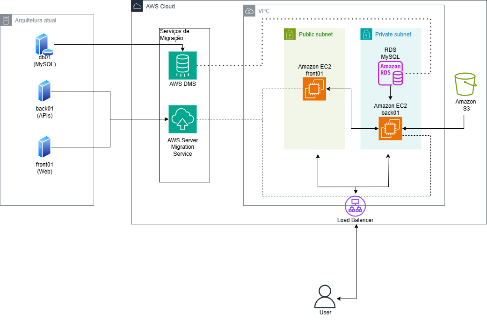
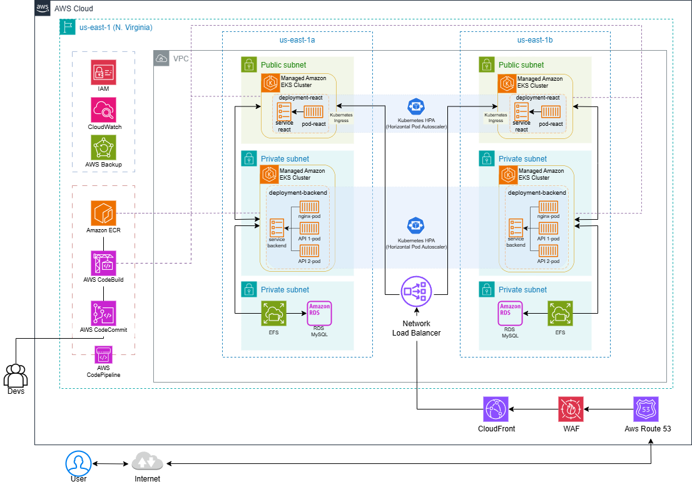

# Projeto-Final

O projeto proposto pela equipe da Compass UOL  que consiste na migração de uma estrutura para o serviço AWS  , a início de forma [**lift-and-shift**](https://www.ibm.com/br-pt/topics/lift-and-shift) e assim uma modernização posterior.

# Documentação de Arquitetura AWS

Este repositório contém a documentação e os diagramas relacionados à transição de uma arquitetura legada para uma solução modernizada em AWS .

## Sumário
- [Introdução](#introdução)
- [Arquitetura Atual](#arquitetura-atual)
- [Arquitetura Proposta](#arquitetura-proposta)
- [Imagens de Referência](#imagens-de-referência)
- [Cálculo de Custos](#cálculo-de-custos)
- [Detalhamento da Modernização](#detalhamento-da-modernização)
- [Documentações de Referência](#documentações-de-referência)
- [Considerações Finais](#considerações-finais)

## Introdução
Este documento detalha a transição de uma arquitetura legada para uma solução modernizada em AWS. A seguir, são apresentados os diagramas que ilustram a arquitetura atual e a proposta de modernização.

### Integrantes da dupla

[**Thalisson Lima**](https://www.github.com/thalssn)  
[**Bruno Pereira**](https://www.github.com/brun-psilva)   

## Arquitetura Atual

A arquitetura atual consiste em uma aplicação monolítica, com os seguintes componentes:

- **db01 (MySQL)**: Servidor de banco de dados.
- **back01 (APIs)**: Servidor que hospeda as APIs.
- **front01 (Web)**: Servidor que hospeda a aplicação web.

### Processos de Migração
Os serviços AWS utilizados para a migração incluem:

- **AWS DMS (Database Migration Service)**: Para migração do banco de dados MySQL.
- **AWS Server Migration Service**: Para migração dos servidores front01 e back01.

#### Diagrama da Arquitetura Atual:

---

## Arquitetura Proposta

Na arquitetura modernizada, a aplicação é executada em um ambiente altamente escalável e gerenciado na AWS. Os principais componentes são:

- **Amazon EKS (Kubernetes Gerenciado)**: Hospeda a aplicação em clusters Kubernetes.
- **Amazon RDS**: Gerencia o banco de dados MySQL de forma escalável e resiliente.
- **EFS (Elastic File System)**: Disponibiliza armazenamento compartilhado para as instâncias do backend.
- **Network Load Balancer**: Faz a distribuição de tráfego para os pods em execução no cluster.
- **CloudFront, WAF e Route 53**: Gerenciam a distribuição global, segurança e roteamento DNS.

#### Diagrama da Arquitetura Proposta:

---

## Imagens de Referência

- **Arquitetura Atual:**
[Diagrama no Drawio (Arquitetura Atual)](link_para_o_arquivo_atual.drawio)

- **Arquitetura Proposta:**
[Diagrama no Drawio (Arquitetura Proposta)](link_para_o_arquivo_proposta.drawio)

---

## Cálculo de Custos

Para estimar os custos associados a esta arquitetura, utilize a [AWS Pricing Calculator](https://calculator.aws/#/). Essa ferramenta permite simular os custos de execução dos serviços utilizados, considerando diferentes níveis de utilização e requisitos.

### Resumo de Custos Estimados:

- **Total Mensal Aproximado:** $1.213,90
  - **Amazon EKS:** Gerenciamento de clusters Kubernetes com escalabilidade automatizada.
  - **Amazon RDS (Multi-AZ):** Alta disponibilidade para banco de dados.
  - **Amazon EFS:** Armazenamento elástico e compartilhado.
  - **Elastic Load Balancer:** Distribuição de tráfego para alta disponibilidade.
  - **AWS Backup:** Políticas automatizadas de backup.
  - **CloudFront e WAF:** Distribuição de conteúdo com proteção contra ataques.

Os custos detalhados podem variar conforme o uso específico de cada serviço, a região e as configurações aplicadas.

---

## Detalhamento da Modernização

### Estrutura Central:

- **Amazon EKS (Elastic Kubernetes Service):**
  Atua como o núcleo da modernização, gerenciando clusters Kubernetes para suportar aplicações conteinerizadas de forma escalável e eficiente.
- **CI/CD com AWS CodePipeline e CodeBuild:**
  Integração e entrega contínuas (CI/CD) automatizam o processo de desenvolvimento e implementação de código no EKS.

### Armazenamento e Bancos de Dados:

- **Amazon RDS com Multi-AZ:**
  Garante alta disponibilidade e redundância geográfica para os bancos de dados.
- **Amazon EFS (Elastic File System):**
  Fornece armazenamento de arquivos elástico e acessível para aplicações.
- **AWS Backup:**
  Automatiza políticas de backup tanto para o EFS quanto para o RDS, com retenção de backups históricos.

### Segurança:

- **IAM (Identity and Access Management):**
  Controle detalhado de permissões e segurança.
- **AWS WAF (Web Application Firewall):**
  Protege contra ataques a aplicações web.
- **Grupos de Segurança e VPC:**
  Subnets públicas e privadas para isolar recursos e restringir acessos.

### Distribuição e Monitoramento:

- **Elastic Load Balancing (ELB):**
  Distribui o tráfego de rede para garantir alta disponibilidade.
- **Amazon CloudFront:**
  Rede de entrega de conteúdo (CDN) que oferece baixa latência para os usuários finais.
- **Amazon CloudWatch:**
  Monitora métricas e logs para garantir a observabilidade e identificar problemas rapidamente.

---

## Documentações de Referência

Para informações mais detalhadas e melhores práticas relacionadas à implementação e ao uso dos serviços mencionados, consulte as documentações oficiais da AWS:

- [Amazon EKS Documentation](https://docs.aws.amazon.com/eks/) 
- [Amazon RDS Documentation](https://docs.aws.amazon.com/rds/) 
- [AWS Elastic Load Balancing Documentation](https://docs.aws.amazon.com/elasticloadbalancing/) 
- [AWS Pricing Calculator Guide](https://docs.aws.amazon.com/awsaccountbilling/latest/aboutv2/calculator.html) 
- [AWS Backup Documentation](https://docs.aws.amazon.com/backup/) 

---

## Considerações Finais

A modernização para uma arquitetura baseada em Kubernetes e serviços gerenciados da AWS traz benefícios como escalabilidade, resiliência e eficiência operacional. Além disso, o uso de ferramentas como o AWS Pricing Calculator permite estimar custos com precisão e planejar o orçamento adequadamente. Este documento serve como referência para implementação e futuras melhorias.
